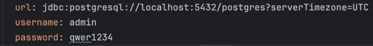
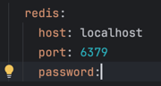
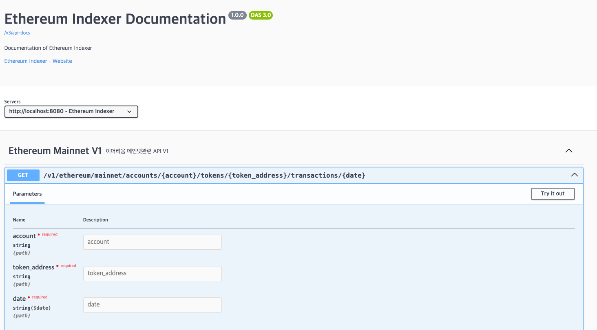
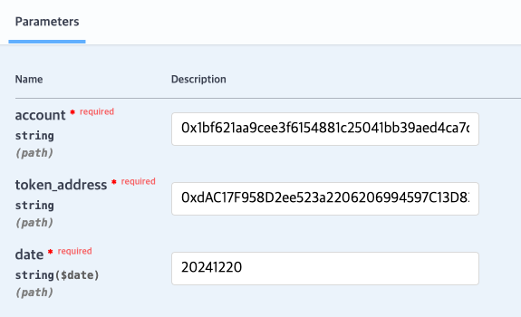
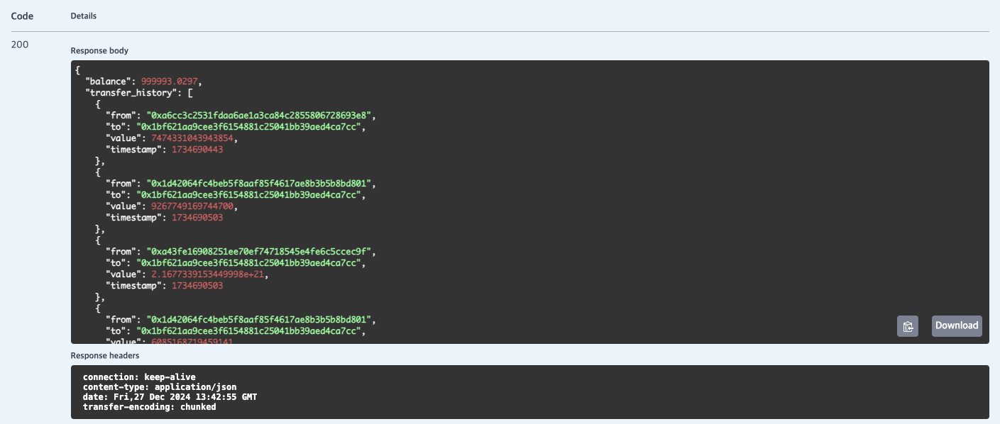

# ethereum-indexer
- 해당 프로젝트는 ETH와 ERC20의 보유량을 추적합니다.

## 실행 방법

### 실행 요구 사항
- 해당 프로그램은 jdk 17버전 이상을 요구합니다.

### 실행 전 세팅
1. root 폴더에 config 폴더 생성 후 infura.yml 파일을 만들고, infura에서 발급받은 ApiKey를 추가합니다.
- 예시
  ``` 
  infura:
    apiKey: a55c3433b235406663e35802030de0ae
  ```

2. /src/main/resources 하위 application.yml 파일에서 database 및 redis 관련 정보를 수정합니다.
- DB 정보 예시

  

- Redis 정보 예시

  

### 실행 명령어
``` ./gradlew bootrun ```


## 패키지 설명
- client
  - 외부 시스템(API)과 통신하는 로직을 구현하는 클래스들을 포함합니다.
  - 현재는 Infura를 통해 ethereum mainnet에 RPC요청을 보내는 로직이 구현되어 있습니다.
- config
  - 애플리케이션의 설정 클래스들로 구성됩니다.
- controller
  - REST API 엔드포인트를 정의하고, 클라이언트 요청을 처리하는 클래스들을 포함합니다.
  - 현재는 요청한 계정에 대한 토큰 보유량 반환 API가 존재합니다.
- entity
  - 데이터베이스와 매핑되는 JPA 엔터티 클래스들을 포함합니다.
- exception
  - 애플리케이션에서 사용하는 커스텀 예외 클래스들을 포함합니다.
- facade
  - 여러 서비스와 클라이언트를 조합하여 비즈니스 로직을 단순화하고 캡슐화한 클래스를 포함합니다.
- model
  - request
    - Client측 요청 모델을 관리합니다.
  - dto
    - 애플리케이션 내부에서 데이터를 전달하거나 표현하기 위한 클래스를 포함합니다.
  - response
    - Client로 반환되는 응답 모델을 관리합니다.
  - result
    - 외부 API 응답 모델을 관리합니다.
- repository
  - 데이터베이스와의 CRUD 작업을 처리하는 클래스들을 포함합니다.
- scheduler
  - 특정 시간 간격으로 작업을 실행하거나 예약된 작업을 처리하는 클래스들을 포함합니다.
  - 현재는 블록, 트랜잭션, 로그 관련 데이터 적재 스케줄러가 존재합니다.
- service
  - 비즈니스 로직을 처리하고 데이터 흐름을 제어하는 클래스들을 포함합니다.
- spec
  - 클라이언트를 추상화하기 위한 인터페이스를 포함합니다.
- util
  - 공통적으로 사용되는 유틸리티 클래스들을 포함합니다.


## API 명세
해당 애플리케이션 실행 후, localhost:8080/docs로 접속하시면 됩니다.



## API 요청 및 응답
현재 존재하는 API 요청 및 응답은 아래와 같습니다.

### 요청
2024/12/20일자 마지막 블록 기준 0x1bf621aa9cee3f6154881c25041bb39aed4ca7cc account의 0xdAC17F958D2ee523a2206206994597C13D831ec7 토큰 보유량 추적


### 응답
